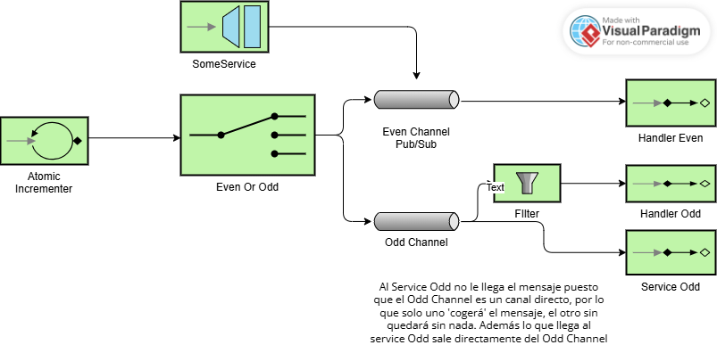

# Lab 5 Integration and SOA - Project Report

## 1. EIP Diagram (Before)

Describe what the starter code does and what problems you noticed.
En el código inicial, se implementa un sistema de integración utilizando patrones de Enterprise Integration Patterns (EIP) con Spring Integration. El sistema recibe una secuencia de números enteros y 
los procesa a través de varios canales y filtros para clasificarlos en números pares y impares.
Sin embargo en dicho código existen múltiples problemas que afecta a su correcto funcionamiento:
- El filtro en oddFlow para identificar números impares no está implementado correctamente, lo que provoca que no se filtren adecuadamente, dejando pasar números pares y rechazando los impares.
- El @Gateway estaba apuntando a evenChannel en lugar de oddChannel, lo que causaba que los números negativos se trataran como pares.
- El canal oddChanel no estaba definido de manera explícita, por lo que Spring creaba un DirectChannel por defecto, lo que podía causar problemas de concurrencia y pérdida de mensajes si había múltiples suscriptores.
---

## 2. What Was Wrong

Explain the bugs you found in the starter code:

- **Bug 1**: What was the problem? Why did it happen? How did   you fix it?
- En primer lugar, el código inicial tenía un problema en el uso del filtro a aplicar en el canal de números primos, pues no se hacía uso de él.
- **Bug 2**: What was the second problem? Why did it happen? How did you fix it?
- En segundo lugar, el oddChanel estaba configurado como un DirectChannel, lo que provocaba inconsistencias en el procesamiento de mensajes, ya que
- cada suscriptor recibía el mensaje de forma exclusiva. (Es decir, si había múltiples suscriptores, solo uno de ellos recibía el mensaje, unas veces uno, y otras el otro).
- Por ello se ha modificado a un PublishSubscribeChannel para asegurar que todos los suscriptores recibieran los mensajes correctamente.
- **Bug 3**: What was the third problem? Why did it happen? How did you fix it? 
- Cuando se enviaba número negativo, el @Gateway estaba apuntando al canal incorrecto (evenChannel). La corrección llevada a cabo a sido redirigir su salida
- al canal numberChannel, que es el canal de entrada principal del sistema.
**Bug 4**:
- Otro error encontrado fue que tanto el puller como el @Gateway no mandaban los datos al numberChannel(no existía aún), sino que el puller mandaba los datos directamente al router  y el @Gateway al evenChannel.
- **(More bugs if you found them)**

---

## 3. What You Learned

Write a few sentences about:

- What you learned about Enterprise Integration Patterns
- He podido aprender acerca del uso de los patrones EIP, los cuáles permiten diseñar flujos de mensajes claros entre componentes desacoplados haciendo uso de canales,
- routers y gateways. Cada patrón tiene un propósito específico, como enrutar, transformar, publicar, etc... La clave está en combinarlos correctamente para que el sistema sea extensible
- y fácil de mantener.
- How Spring Integration works
- What was challenging and how you solved it:
- Lo más desafiante fue identificar los errores en el flujo de integración y entender cómo cada aplicar cada patrón EIP y su implementación.

---

## 4. AI Disclosure

**Did you use AI tools?** (ChatGPT, Copilot, Claude, etc.)

- If YES: Which tools? What did they help with? What did you do yourself?
- If NO: Write "No AI tools were used."

**Important**: Explain your own understanding of the code and patterns, even if AI helped you write it.

---

## Additional Notes

Any other comments or observations about the assignment.
